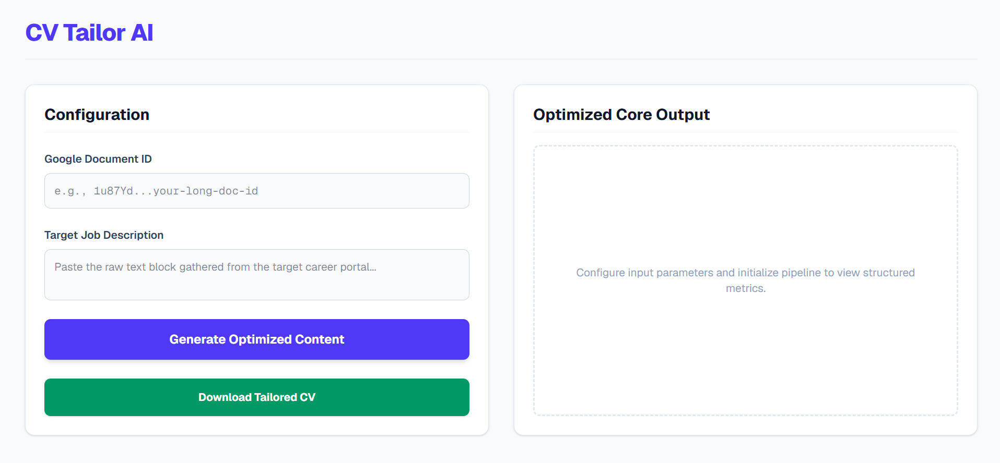
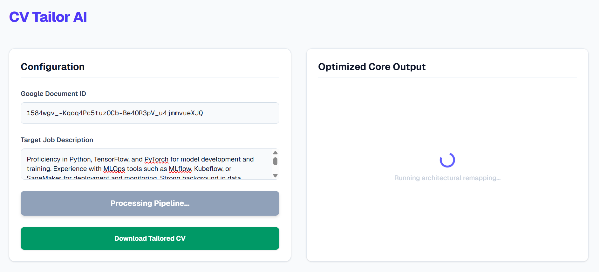
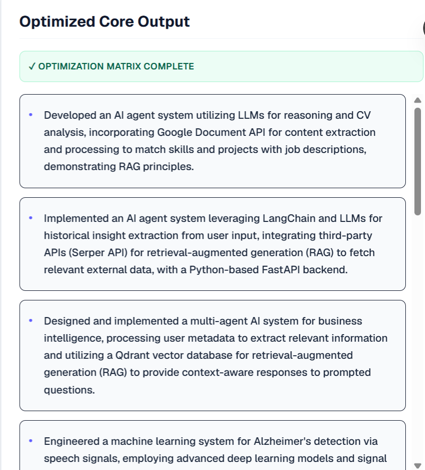

# AI Resume Tailor Agent

Personally this Agent is my favorite project. I built to solve real life problems (including my own) and it has been helpful.

A full-stack application that analyzes your Google Doc resume alongside a target job description, optimizes your work experience and skills using Gemini AI, and exports a tailored PDF (all while keeping your original document untouched).

---
## How It Works:
1. **Provide Your Inputs:** Pass in your Google Doc resume ID and the targeted job description.
2. **Context-Aware AI Optimization:** The AI agent analyzes your experience and rewrites project bullet points and skills to align with the job description (without hallucinating false information or fake experience).
3. **Safe Duplicate & Replace Workflow:** The system creates a temporary copy of your CV in your Google Drive, performs precise find-and-replace updates via the Google Docs API, exports the result as a PDF, and cleans up after itself. Your original master resume remains intact.
4. **Direct Download:** Download your newly optimized, tailored resume directly as a PDF from the UI.

---
## What I learned building this project:
- Google Cloud & OAuth 2.0 Integration
- State Management with Zustand
- Structured AI Outputs

---
## Demo & Results

-

-

---
## Future Work
I'm happy with where this agent is today, but for future work, turning this into a deployed web app would make it much easier to use than running it locally.
